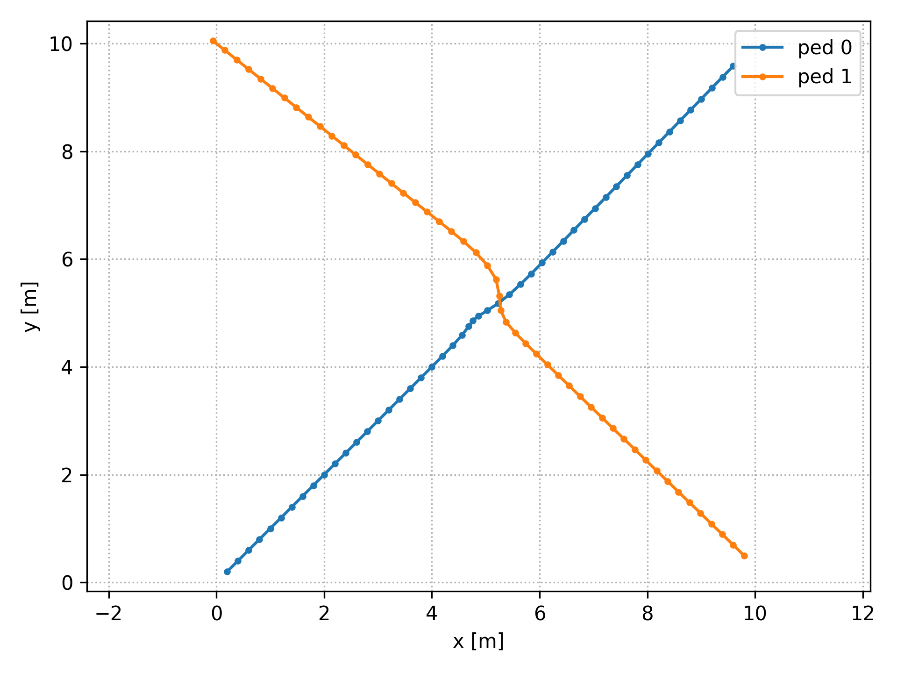
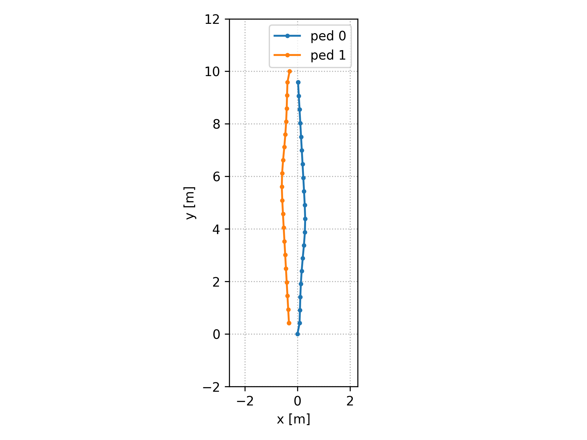
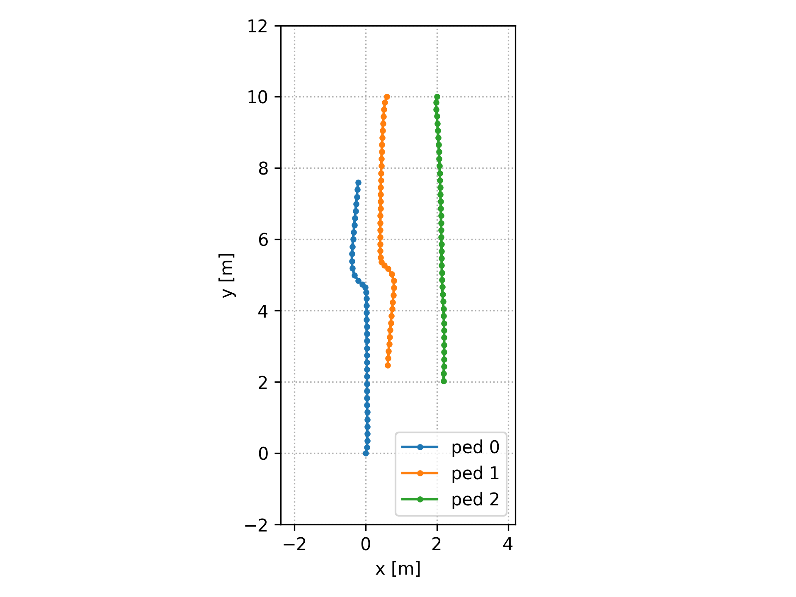
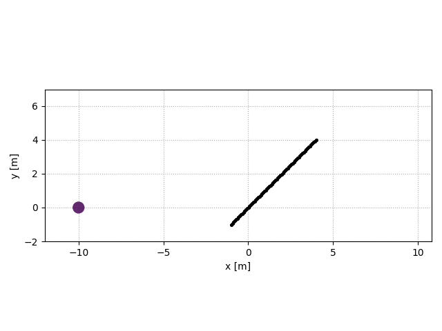
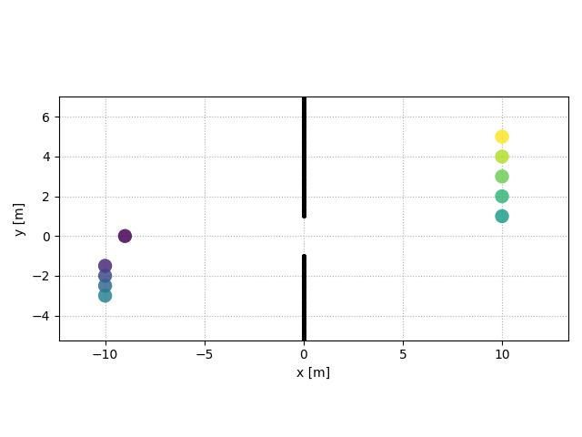
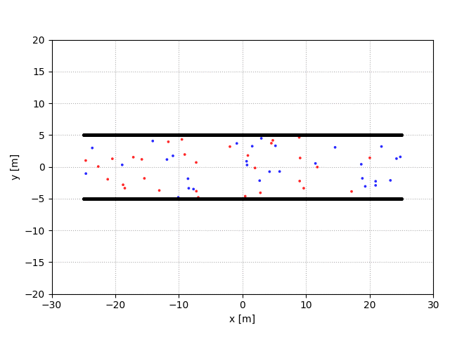
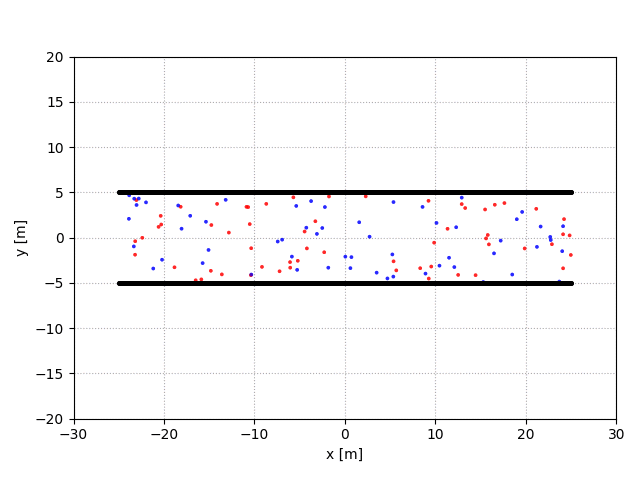
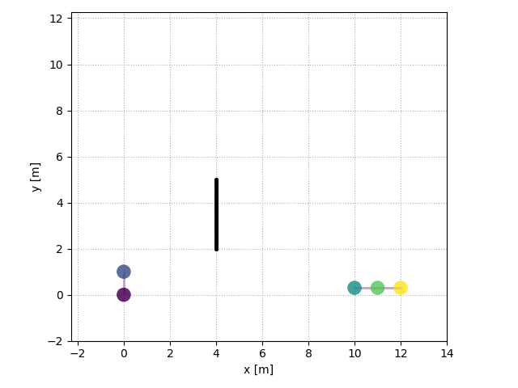

# PySocialForce

master: [](https://travis-ci.com/yuxiang-gao/PySocialForce)
dev: [](https://travis-ci.com/yuxiang-gao/PySocialForce)

A Python Implementation of the Extended Social Force Model for Pedestrian Dynamics

## Table of Contents

- [PySocialForce](#pysocialforce)
  - [Table of Contents](#table-of-contents)
  - [About The Project](#about-the-project)
    - [Roadmap](#roadmap)
  - [Installation](#installation)
  - [Usage](#usage)
  - [Configuration](#configuration)
  - [Examples](#examples)
    - [Ped-ped Scenarios](#ped-ped-scenarios)
    - [Environmental obstacles](#environmental-obstacles)
    - [Groups](#groups)
  - [Contributing to this project](#contributing-to-this-project)
  - [License](#license)
  - [Acknowledgements](#acknowledgements)
  - [References](#references)

## About The Project

This project is a NumPy implementation of the **Extended Social Force Model** [[2]](#2).
It extends the vanilla social force model [[1]](#1) to simulate the walking behaviour of pedestrian social groups.

### Roadmap

- [x] Simulation of indiviual pedestrians
- [x] Social groups simulation
- [ ] Inter-group interactions
- [x] Environmental obstacles
- [ ] Better environment representation
- [x] Easy configuration with toml file
- [x] Visualization of indiviuals and groups
- [ ] Visualization of forces/potentials

## Installation

1. Clone the PySocialForce repo

    ```sh
    git clone https://github.com/yuxiang-gao/PySocialForce.git
    ```

2. (optional) Create a python virtual environment and activate it
3. Install the pip package

    ```sh
        # Option 1: install from PyPI
        pip install 'pysocialforce[test,plot]'

        # Option 2:  install from source
        pip install -e '.[test,plot]'

        # run linting and tests
        pylint pysocialforce
        pytest tests/*.py
    ```

## Usage

Basic usage:

```python
import pysocialforce as psf
# initiate simulator
sim = psf.Simulator(
        initial_state, groups=groups, obstacles=obstacles
    )
# do 50 updates
sim.step(n=50)
```

To generate an animation of the simulation, use the `SceneVisualizer` context:

```python
with psf.plot.SceneVisualizer(simulator, "output_image") as sv:
    sv.animate()
```
For more examples, please refer to the [examples folder](examples).

## Configuration
You can configure the parameters by passing in a [toml](https://github.com/toml-lang/toml) file to the simulator:
```Python
sim = psf.Simulator(
        initial_state, groups=groups, obstacles=obstacles, config_file="user_config.toml"
    )
```

By default the simulator loads the configurations at [pysocialforce/utils/default.toml](pysocialforce/utils/default.toml).
An example of the user config and the explanation of the parameters is provided at [examples/example.toml](examples/example.toml).
Each force has a parameter named `factor`, which is the scale factor for that force. For specific parameters for each force, refer to the comments in the example below:
```Toml
...
[desired_force]
factor = 1.0
# The relaxation distance of the goal
goal_threshold = 0.2
# How long the relaxation process would take
relaxation_time = 0.5

[social_force]
factor = 5.1
# relative importance of position vs velocity vector
lambda_importance = 2.0
# define speed interaction
gamma = 0.35
n = 2
# define angular interaction
n_prime = 3

[obstacle_force]
factor = 10.0
# the standard deviation of obstacle force
sigma = 0.2
# threshold to trigger this force
threshold = 3.0

[group_coherence_force]
factor = 3.0

[group_repulsive_force]
factor = 1.0
# threshold to trigger this force
threshold = 0.55

[group_gaze_force]
factor = 4.0
# fielf of view
fov_phi = 90.0
```

## Examples

### Ped-ped Scenarios

|           |  |
| ----------------------------------------- | ------------------------------------- |
|  |     |

### Environmental obstacles

|                                                                              |                                                                                        |
| ------------------------------------------------------------------------------------------------------------- | -------------------------------------------------------------------------------------------------------------- |
| Emergent lane formation with Emergent lane formation with 30 pedestrians:  | Emergent lane formation with Emergent lane formation with 60 pedestrians:   |

### Groups



## Contributing to this project
Thanks for your interest in contributing! PySocialForce is a open-source project and we welcome contributions of any kind.
If you find a bug or have a feature request, feel free to contact us using [Github issues](https://github.com/yuxiang-gao/PySocialForce/issues). If you are reporting a bug, please try to include a minimal example to recreate it. If you are requesting a feature, please also give some possible use cases to justify the request.
If you want to help with development, you can work on a fork of the project and start a pull request. Please document your code and make sure that you have added the necessary tests and examples. Please also adhere to [semantic versioning](https://semver.org).

## License

Distributed under the MIT License. See `LICENSE` for more information.

## Acknowledgements

- This project is based on [svenkreiss](https://github.com/svenkreiss)'s implementation of the vanilla social force model.
- The implementation of forces drew inspiration from the [pedsim_ros][pedsim_ros] package.

## References

<a id="1">[1]</a> Helbing, D., & Molnár, P. (1995). Social force model for pedestrian dynamics. Physical Review E, 51(5), 4282–4286. <https://doi.org/10.1103/PhysRevE.51.4282>

<a id="2">[2]</a> Moussaïd, M., Perozo, N., Garnier, S., Helbing, D., & Theraulaz, G. (2010). The walking behaviour of pedestrian social groups and its impact on crowd dynamics. PLoS ONE, 5(4), 1–7. <https://doi.org/10.1371/journal.pone.0010047>

[socialforce]: https://github.com/svenkreiss/socialforce

[pedsim_ros]: https://github.com/srl-freiburg/pedsim_ros
