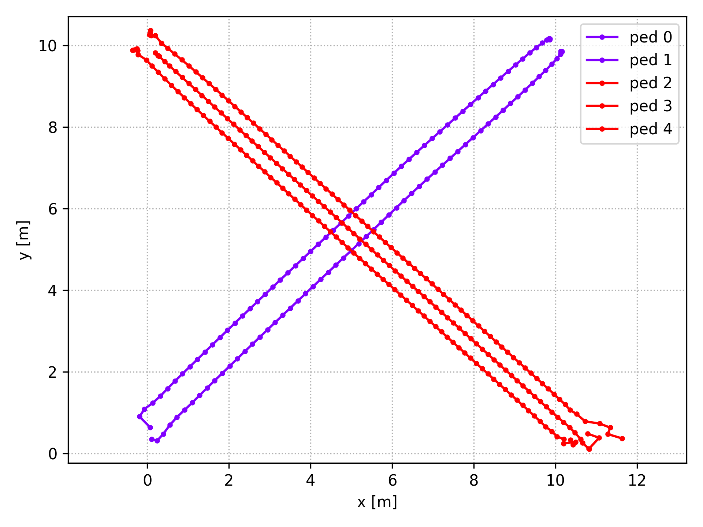

# py-social-force

master: [](https://travis-ci.com/yuxiang-gao/py-social-force)
dev: [](https://travis-ci.com/yuxiang-gao/py-social-force)

Extended Social Force Model implemented in NumPy


## Table of Contents

- [py-social-force](#py-social-force)
  - [Table of Contents](#table-of-contents)
  - [About The Project](#about-the-project)
    - [Features](#features)
  - [Installation](#installation)
  - [Usage](#usage)
  - [Examples](#examples)
    - [Ped-ped Scenarios](#ped-ped-scenarios)
    - [Environmental obstacles](#environmental-obstacles)
    - [Groups](#groups)
  - [License](#license)
  - [Acknowledgements](#acknowledgements)
  - [References](#references)

## About The Project

This project is a NumPy implementation of the **Extended Social Force Model** [[2]](#2).
It extends the vanilla social force model [[1]](#1) to simulate the walking behaviour of pedestrian social groups.

### Features

- Simulation of indiviual pedestrians
- Social groups simulation
- Environmental obstacles
- Easy configuration with toml file
- Visualization

## Installation
 
1. Clone the py-social-force repo

    ```sh
    git clone https://github.com/yuxiang-ago/py-social-force.git
    ```

2. (optional) Create a python virtual environment and activate it
3. Install the pip package

    ```sh
        # install from PyPI
        pip install 'py-social-force[test,plot]'

        # or install from source
        pip install -e '.[test,plot]'

        # run linting and tests
        pylint pysocialforce
        pytest tests/*.py
    ```


## Usage

Basic usage:

```python
import pysocialforce as psf
# initiate simulator
sim = psf.Simulator(
        initial_state, groups=groups, space=space, config_file="config.toml"
    )
# do one update
sim.step()
```

You can configure the parameters by passing in a [toml](https://github.com/toml-lang/toml) file.
Default configurations are located in the [config.toml](config.toml) file in root directory.

For more examples, please refer to the [examples folder](examples).

## Examples
### Ped-ped Scenarios
|                                           |                                       |
| ----------------------------------------- | ------------------------------------- |
|           |  |
|  |     |
### Environmental obstacles
|                                                                                                      |                                                                                                       |
| ---------------------------------------------------------------------------------------------------- | ----------------------------------------------------------------------------------------------------- |
|                                                                     |                                                                               |
| Emergent lane formation with Emergent lane formation with 30 pedestrians:  | Emergent lane formation with Emergent lane formation with 60 pedestrians:   |

### Groups



## License

Distributed under the MIT License. See `LICENSE` for more information.

## Acknowledgements

- This project is based on [svenkreiss](https://github.com/svenkreiss)'s implementation of the vanilla social force model.
- The group forces drewn inspiration from the [pedsim_ros][pedsim_ros] package.

## References

<a id="1">[1]</a> Helbing, D., & Molnár, P. (1995). Social force model for pedestrian dynamics. Physical Review E, 51(5), 4282–4286. https://doi.org/10.1103/PhysRevE.51.4282

<a id="2">[2]</a> Moussaïd, M., Perozo, N., Garnier, S., Helbing, D., & Theraulaz, G. (2010). The walking behaviour of pedestrian social groups and its impact on crowd dynamics. PLoS ONE, 5(4), 1–7. https://doi.org/10.1371/journal.pone.0010047

[socialforce]: https://github.com/svenkreiss/socialforce

[pedsim_ros]: https://github.com/srl-freiburg/pedsim_ros