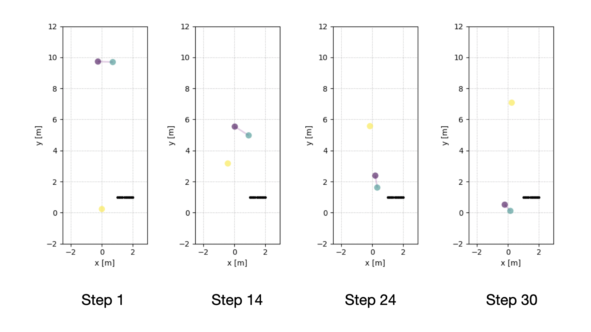
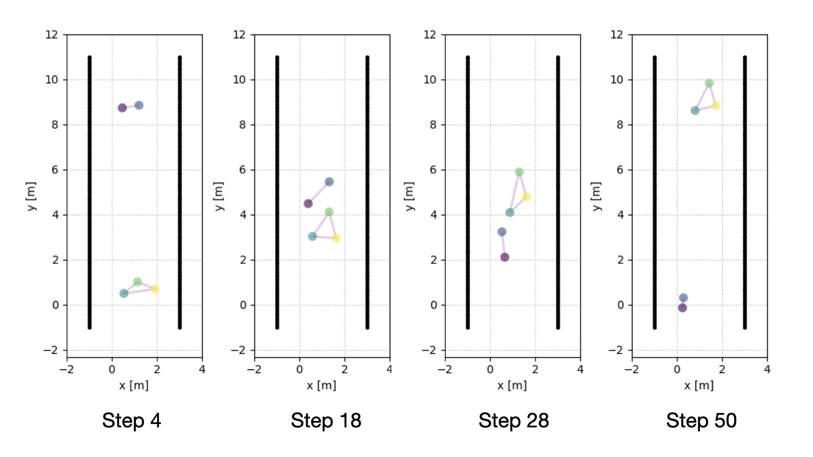

# Summary
Modeling pedestrian dynamics has a variety of valuable applications, ranging from emergency simulation and urban planning to crowd simulation in video games and movies. Pedestrian simulation also plays an important role in developing mobile robots that are capable of navigating crowded human environments in a safe, efficient, and socially appropriate manner; these robots promise to bring practical robotic assistance---such as emergency response, parcel delivery, and guided tours---to our daily lives. While robot navigation has been widely studied, *socially acceptable* navigation in crowded environments remains a challenge due to the rich dynamics of social interactions between pedestrians and the limited human data available for training and validating social navigation algorithms.

Crowd simulation offers an alternate source of data for developing modern machine learning algorithms for social navigation. One popular model for pedestrian dynamics is the social force model proposed by @Helbing:1995, which suggests that pedestrian behaviors can be modeled as if they are subject to "social forces." To simulate social groups, which constitute most human crowds, @Moussaid:2010 extended this model by introducing additional forces for social groups.

`PySocialForce` is a pure Python package for simulating crowd dynamics based on the extended social force model. While it can be used for general crowd simulation, it is designed with social navigation applications in mind. Our Python implementation makes it easily extensible (e.g., adding new custom "social forces") and able to interface with modern reinforcement learning environments (e.g., [OpenAI Gym](https://gym.openai.com/)).

# The `PySocialForce` Package
`PySocialForce` implements the social force model described in [@Moussaid:2009] and its extension with social groups described in [@Moussaid:2010]. The package started as a fork of `socialforce` [@socialforce], which implements the original social force model proposed in [@Helbing:1995]; however, we ended up rewriting the package to use the extended version of the social force model as described in [@Moussaid:2009; @Moussaid:2010] with its core functions accelerated with just-in-time compilation using [Numba](https://numba.pydata.org/). We also drew inspiration from the `pedsim_ros` [@pedsimros] package, an [ROS](https://www.ros.org/) package that implements the extended social force model. However, as it is a GUI application and has dependency on both [ROS](https://www.ros.org/) and [QT](https://www.qt.io/), we have found it difficult to run `pedsim_ros` on servers without the X Window System.

In our implementation, we calculate six default forces. Three of them [@Moussaid:2009] are for individuals: 

1. the repulsive forces between pedestrians;
2. the attractive forces between each pedestrian and their goal(s);
3. the repulsive forces from obstacles.

The other three forces [@Moussaid:2010] are for groups: 

4. the coherence force that holds group members together;
5. the repulsive force that keeps members from getting too close to each other;
6. a force calculated from the gaze directions of pedestrians to maintain group formations. 

Users can easily create their own forces by inheriting the `Force` metaclass.

To use `PySocialForce`, the user passes in the initial states---the positions, velocities, and goals of the pedestrians---and the optional information of social groups and obstacles. Input parameters can be passed in as a `toml` file. Given the necessary initial state information, a typical example of running the simulator for 50 timesteps is shown in the example below:

```python
import pysocialforce as psf
simulator = psf.Simulator(initial_state,
                          groups=groups,
                          obstacles=obstacles,
                          config_file="my_config.toml")
simulator.step(50)
```

After the simulation finishes, one can easily generate an animation of the simulation with the provided `SceneVisualizer` context:

```python
with psf.plot.SceneVisualizer(simulator, "output_image") as sv:
    sv.animate()
```

The result of this example is shown in \autoref{fig:example}. In this example, a two-person group encounters a single pedestrian coming from the other direction and adjusts accordingly, all while avoiding an obstacle in their path. The group members are interconnected with a purple line. \autoref{fig:corridor} shows another example with a corridor setup. 





# Acknowledgments
This project is supported by the Johns Hopkins University Institute for Assured Autonomy.

# References